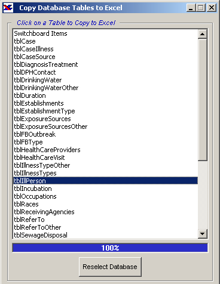



## ADO to Excel

### Description

Allows users to select any DSN-less ODBC data source, or an MS Access database, to display the tables in it, and select a table, which is automatically loaded into an Excel spreadsheet, complete with column headings (field names). Based on project submitted by Ian Mitchell:

http://www.planetsourcecode.com/xq/ASP/txtCodeId.25934/lngWId.1/qx/vb/scripts/ShowCode.htm

I just changed it to use ADO instead of DAO, and DSN-Less ODBC data sources, instead of just MS Access.

Slight modifications (error handling etc) on august 9, 2001
 
### More Info
 

             |
---                |---
**Submitted On**   |2001-08-09 18:35:32
**By**             |[Brian Battles WS1O](https://github.com/Planet-Source-Code/PSCIndex/blob/master/ByAuthor/brian-battles-ws1o.md)
**Level**          |Intermediate
**User Rating**    |4.9 (49 globes from 10 users)
**Compatibility**  |VB 6\.0
**Category**       |[Databases/ Data Access/ DAO/ ADO](https://github.com/Planet-Source-Code/PSCIndex/blob/master/ByCategory/databases-data-access-dao-ado__1-6.md)
**World**          |[Visual Basic](https://github.com/Planet-Source-Code/PSCIndex/blob/master/ByWorld/visual-basic.md)
**Archive File**   |[ADO to Exc24350892001\.zip](https://github.com/Planet-Source-Code/brian-battles-ws1o-ado-to-excel__1-25958/archive/master.zip)

